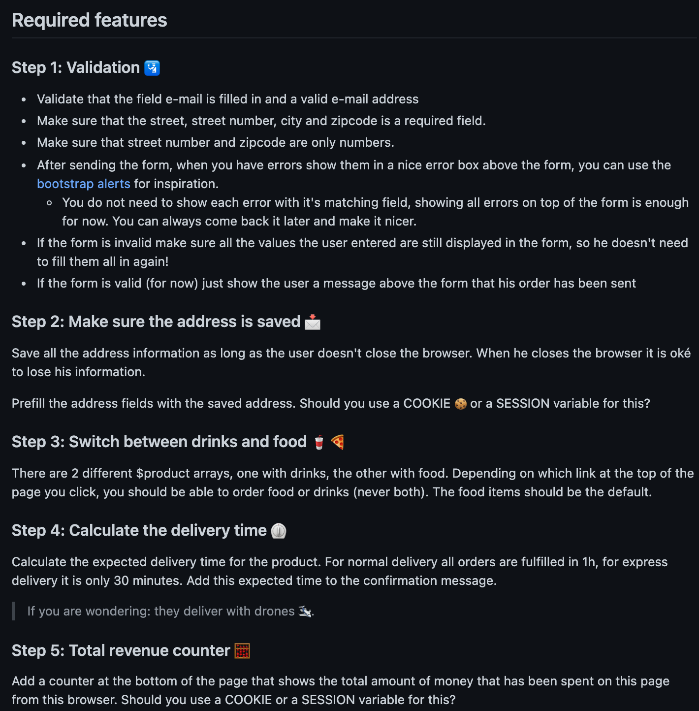

# PHP order form
manipuler un formulaire avec PHP

## Cadre:
Cet exercice est effectué dans le cadre de la douzième semaine de formation au centre de formation BECODE. 
Nous sommes en mars 2021.

## Technos utilisées:
* HTML 
* Bootstrap
* PHP

## Auteurs: 
Porjet solo

## Instructions:
Délai: 4 jours

## Statut:
terminé

## Projet déployé: 
Lien Github : https://github.com/RekhaLambotte/php-order-form.git

Lien Web : https://pizzabecode.herokuapp.com/

